# BOOST architecture

Diagrams of the system as it is actually built. Every relationship here was read
out of the code — route mounts in `backend/server.js`, the tables in
`backend/schema.sql`, the mounts in each `frontend/*.html`.

Each diagram is authored as Mermaid in [`diagrams/src/`](diagrams/src) and rendered
here to SVG. The Mermaid is kept as plain `.mmd` files rather than fenced blocks in
this page because GitHub's Mermaid renderer is stricter than the one used to draw
them — it dropped the HTML tags these diagrams use inside node labels — so the
images are embedded instead and the source sits beside them. That also means each
diagram can be pasted straight into Lucidchart's **Diagram as code** panel.

---

## Component diagram

What the system is made of, and how the pieces depend on each other.


<sub>Mermaid source: [diagrams/src/component-diagram.mmd](diagrams/src/component-diagram.mmd) &middot; also as [PNG](diagrams/component-diagram.png)</sub>

---

## Deployment diagram

What has to exist for BOOST to run, and where each piece lives.


<sub>Mermaid source: [diagrams/src/deployment-diagram.mmd](diagrams/src/deployment-diagram.mmd) &middot; also as [PNG](diagrams/deployment-diagram.png)</sub>

### Runtime notes

- **One process.** `server.js` keeps serving through an unhandled error so a
  single OCR fault cannot take procurement offline for everyone. The exception
  is a port-bind failure, which exits `1` rather than leaving a dead process
  holding nothing.
- **Postgres is the only stateful dependency.** Everything else is rebuildable.
- **Uploads and OCR model are on disk, not in git.** `setup-ocr.js` fetches the
  language data; `.gitignore` excludes both directories.
- **SMTP is optional.** With no `SMTP_HOST`, the reset link is printed to the
  server console and, in development only, returned in the API response.

---

## Class diagram

The backend's structural classes and their collaborators, as they are actually
wired in `server.js`.



<sub>Mermaid source: [diagrams/src/class-diagram.mmd](diagrams/src/class-diagram.mmd) &middot; also as [PNG](diagrams/class-diagram.png)</sub>

---

## Data model

Not requested, but a class diagram without it tends to get asked for next.



<sub>Mermaid source: [diagrams/src/data-model.mmd](diagrams/src/data-model.mmd) &middot; also as [PNG](diagrams/data-model.png)</sub>

Two relationships that look obvious are deliberately **not** drawn, because the
schema does not have them:

- **`documents` has no `request_id`.** A document belongs to whoever uploaded
  it, not to a request, so there is no request-to-document link.
- **`bid_submissions` has no `user_id`.** A submission records a supplier
  *name*, not an account, because offers can come from suppliers with no login
  in BOOST. `UNIQUE (bid_id, supplier_name)` is what stops a supplier bidding
  twice on one package.

Two rules the schema enforces rather than trusting the application code:

- `idx_bid_single_award` — a partial unique index allowing at most **one**
  awarded submission per package.
- `password_reset_tokens.token_hash` — the token is stored only as a SHA-256
  hash, so a database leak cannot be replayed against the reset endpoint.

---

## Rendered images

The Mermaid blocks above render on GitHub. The same diagrams are also written out
as files, in both SVG (scales for print, a few KB) and PNG at 2× for pasting
straight into a document:

| Diagram | SVG | PNG |
| --- | --- | --- |
| Component | [component-diagram.svg](diagrams/component-diagram.svg) | [component-diagram.png](diagrams/component-diagram.png) |
| Deployment | [deployment-diagram.svg](diagrams/deployment-diagram.svg) | [deployment-diagram.png](diagrams/deployment-diagram.png) |
| Class | [class-diagram.svg](diagrams/class-diagram.svg) | [class-diagram.png](diagrams/class-diagram.png) |
| Data model | [data-model.svg](diagrams/data-model.svg) | [data-model.png](diagrams/data-model.png) |

Module screenshots live alongside them in [`screenshots/`](screenshots/).

### Regenerating

```bash
cd backend
npm run docs:diagrams   # re-render the images from diagrams/src/*.mmd
npm run docs:shots      # re-capture the module screenshots
npm run docs            # both
```

Both drive the Edge already installed on the machine over the Chrome DevTools
Protocol (`scripts/lib/browser.js`), so no browser-automation package is needed.
`docs:diagrams` doubles as a syntax check: a diagram Mermaid cannot parse is
reported as a failure rather than quietly producing an empty image.

> The class diagram is wide (3378px) because Mermaid lays classes out in a single
> band. Use the SVG if it needs to fit a portrait page — it scales without
> blurring.

### Editing these in Lucidchart

Lucidchart reads Mermaid directly, so nothing needs converting:

1. Open a Lucidchart document.
2. **Diagram as code** in the left toolbar (Individual, Team or Enterprise plans).
3. **+ New Mermaid diagram**, paste the contents of the matching `.mmd` file,
   **Generate**.

All four types here are supported — Flowchart, Class and Entity Relationship.
Two things to expect: the code must be in English, and once generated the diagram
is edited *through the code* rather than by dragging shapes.

### Checking these against the code

The diagrams assert names that can drift, so they are verified mechanically:

```bash
npm run check:diagrams   # 74 assertions
npm run check:schema     # proves the schema builds from an empty database
npm run check            # all three, plus the route sweep
```

`check:diagrams` parses the `.mmd` sources and compares them with the code: service
and middleware members must exist, every route mount and endpoint count must match,
every table and column in the data model must exist *and* nothing may be missing
from it, and each dependency, env var and on-disk path named above must be real.

That check has already earned its keep. It caught that `documents` has no
`request_id` and `bid_submissions` no `user_id` — two relationships this file
originally drew that the schema does not have.